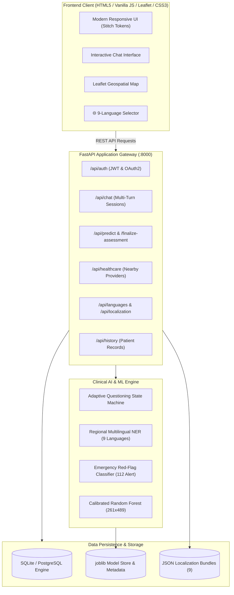
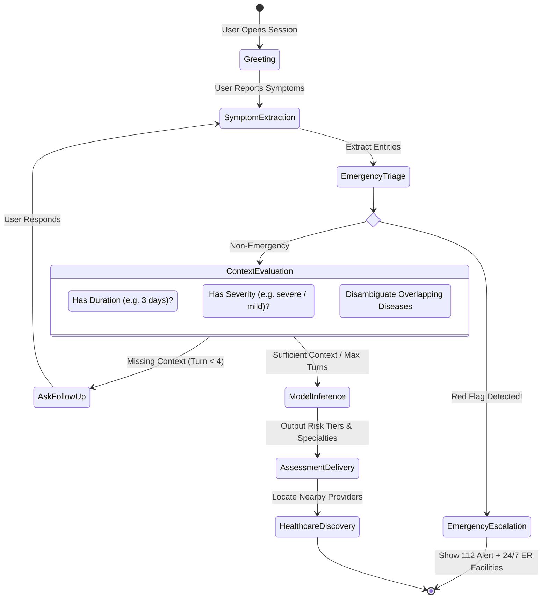
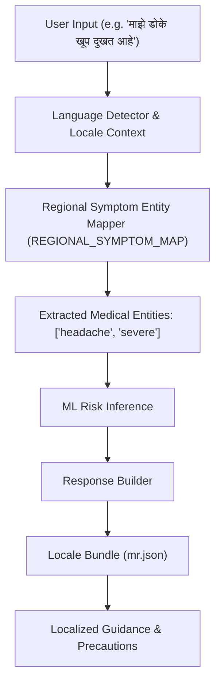
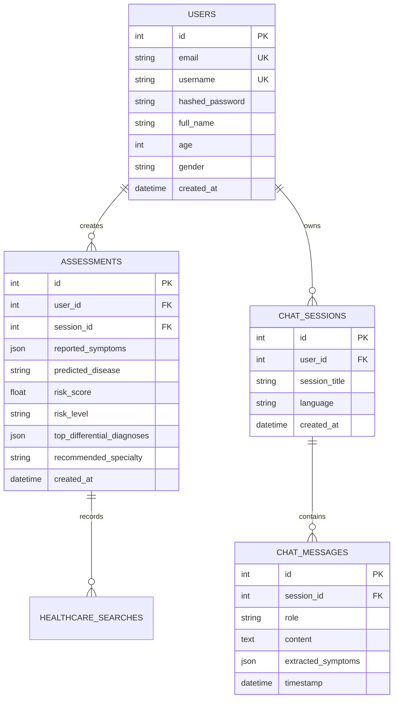

# System Design Document: CareGenie AI Health Assistant
**Sub-title**: Intelligent Multi-Turn Symptom Assessment, ML Disease Risk Prediction & Geospatial Healthcare Discovery  
**Author**: Engineering & Clinical Informatics Team  
**Version**: 2.1.0  
**Status**: Implemented & Verified (Production Ready)

---

## 1. Executive Summary & Architectural Overview

The **Personalized AI Health Assistant** is an end-to-end clinical triage and disease risk estimation platform. It bridges the gap between patient self-reporting and professional medical care by:
1. Conducting **adaptive, multi-turn conversational symptom elicitation** in **9 regional Indian languages** (English, Hindi, Marathi, Bengali, Telugu, Tamil, Gujarati, Kannada, Punjabi).
2. Performing **emergency red-flag screening** with immediate escalation to national emergency hotlines (112/108/911).
3. Utilizing a calibrated **Machine Learning Classifier (Random Forest)** trained on 261 disease categories and 489 clinical symptoms.
4. Locating verified nearby healthcare facilities (hospitals, multi-specialty clinics, diagnostic centers) using real-time **GPS + IP geolocation** and **Haversine spatial filtering**.
5. Persisting clinical assessment records with user authentication, JWT-based security, and privacy isolation.



---

## 2. Design System & UI/UX Specifications (Stitch — Clinical Empathy & Intelligence)

The visual identity and interface architecture follow the **Stitch Clinical Empathy Design System** generated via Stitch MCP (`projects/17808735738301924316`, screen `b10490a634de41ffa43ba7db1b6e1f97`), tailored specifically for clinical precision, patient calmness, and medical authority.

### 2.1 Color Palette & Design Tokens
```css
:root {
  /* Stitch Clinical Empathy Primary Palette */
  --color-primary: #0F766E;          /* Deep Clinical Teal - Primary brand */
  --color-primary-dark: #0D5C56;     /* Deep Teal Dark - Hover / active states */
  --color-primary-light: #CCFBF1;    /* Teal Wash - Selected states / chips */
  --color-primary-navy: #0B192C;     /* Authoritative Deep Navy - Headers & text */

  /* Neutral Slate Canvas & Surfaces */
  --color-slate-50: #F8FAFC;         /* Clean Medical Canvas - High clarity */
  --color-slate-100: #F1F5F9;        /* Subtle container backgrounds */
  --color-slate-200: #E2E8F0;        /* Card hairline borders */
  --color-slate-300: #CBD5E1;        /* Muted icons / form borders */
  --color-slate-500: #64748B;        /* Secondary & supporting metadata */
  --color-slate-700: #334155;        /* Secondary headers */
  --color-slate-900: #0F172A;        /* High-contrast body typography */

  /* Clinical Accents & Triage Severity */
  --color-cyan-500: #0284C7;         /* Precision Cyan - Focus rings / active tabs */
  --color-cyan-50: #E0F2FE;          /* Soft Cyan Tint */
  --color-emerald-600: #059669;      /* Low Risk / Certified Verified Status */
  --color-amber-500: #D97706;        /* Moderate Risk / Clinical Warning */
  --color-rose-600: #E11D48;         /* Severe / Emergency Red-Flag Triage */
  --color-rose-50: #FFF1F2;          /* Urgent alert background banner */

  /* Layered Ambient Elevation */
  --shadow-sm: 0 1px 2px rgba(11, 25, 44, 0.04);
  --shadow-md: 0 4px 12px -2px rgba(11, 25, 44, 0.06), 0 2px 4px -1px rgba(11, 25, 44, 0.03);
  --shadow-lg: 0 10px 24px -4px rgba(11, 25, 44, 0.08), 0 4px 8px -2px rgba(11, 25, 44, 0.03);
  --shadow-focus: 0 0 0 3px rgba(15, 118, 110, 0.22);

  /* Ergonomic Geometry */
  --radius-sm: 6px;                  /* Input fields & small buttons */
  --radius-md: 10px;                 /* Form controls & badges */
  --radius-lg: 16px;                 /* Elevated medical cards & containers */
  --radius-full: 9999px;             /* Status pills & action badges */
}
```

### 2.2 Geometry & Typography Architecture
- **Ergonomic Rounded Corners**: 
  - Standard cards, modal dialogs, and chat containers utilize **10px–16px radii** (`--radius-lg`), eliminating harsh retro 2px corners in favor of calm, humane clinical aesthetics.
  - Interactive pill buttons and badges feature smooth **9999px curvature**.
- **Soft Ambient Elevation**:
  - Replaces flat retro borders with multi-layered diffuse drop shadows (`0 4px 12px -2px rgba(11, 25, 44, 0.06)`), establishing clear visual hierarchy.
- **Top Emergency Triage Strip**:
  - Prominent high-contrast alert strip anchored atop the viewport (`#FFF1F2` / `#E11D48`) offering instant emergency hotline escalation (112 / 911).
- **Typography**:
  - `Plus Jakarta Sans` with `Inter` fallbacks, calibrated with clean letter-spacing (`-0.015em`) and balanced line heights for high medical legibility.

### 2.3 Authentication Wall & Feature Gating
- **Strict Clinical Feature Gate**:
  - Unauthenticated access to **Symptom Checker** (`/chat`), **Risk Assessment** (`/assessment`), **Hospital Locator** (`/map`), and **Patient Records** (`/history`) triggers the Stitch Auth Modal.
  - An inline guidance banner (`#auth-gate-banner`) explains the requirement (HIPAA & ABDM privacy compliance and personalized medical record encryption).
  - Users are seamlessly redirected to their intended destination upon successful login or registration via `pendingRedirectAction`.
- **Emergency Safety Bypass**:
  - Critical triage and emergency escalation remain unconditionally accessible even to unauthenticated guests, fulfilling clinical safety ethics.

---

## 3. Conversational AI & Adaptive Clinical State Machine

Unlike static symptom checkers that present rigid 50-question forms, this system implements an **Adaptive Questioning State Machine** that mimics an experienced clinician's intake interview.



### 3.1 Adaptive Clarification Rules
1. **Duration Clarification**: If duration is unmentioned, asks: *"How long have you been experiencing [symptom]?"*
2. **Severity Clarification**: If intensity is unmentioned, asks: *"Could you describe the severity (mild, moderate, or severe)?"*
3. **Differential Disambiguation**: Queries for distinguishing symptoms when top diagnostic candidates share >70% symptom overlap.
4. **Early Exit / Stopping Condition**: If both duration, severity, and at least 3 clinical features are provided, questioning terminates early to prevent patient fatigue.

---

## 4. Machine Learning Diagnostic Engine

### 4.1 Model Architecture
- **Algorithm**: Random Forest Classifier with Isotonic Probability Calibration (`CalibratedClassifierCV`).
- **Feature Space**: 489 one-hot binary clinical symptom vectors.
- **Target Space**: 261 distinct disease classifications across internal medicine, cardiology, dermatology, gastrointestinal, neurology, and infectious diseases.
- **Artifact**: `backend/app/ai/models/disease_risk_model.joblib` with serialized feature names and label encoders.

### 4.2 Tiers of Risk Evaluation
| Risk Tier | Probability Range | Action Recommendation | UI Styling |
| :--- | :--- | :--- | :--- |
| **Low** | $P < 0.35$ | Routine self-care, hydration, schedule non-urgent checkup | Green Badge (`#10b981`) |
| **Moderate** | $0.35 \le P < 0.70$ | Schedule outpatient doctor consultation within 24-48 hours | Amber Badge (`#f59e0b`) |
| **High** | $P \ge 0.70$ | Immediate clinical evaluation at urgent care / ER | Red Badge (`#ef4444`) |

---

## 5. Geospatial Healthcare Provider Architecture

```mermaid
flowchart LR
    Browser["Client Browser"] -->|1. GPS Coordinates| GeolocationAPI["navigator.geolocation"]
    GeolocationAPI -->|Permission Denied| IPFallback["ipwho.is IP Geolocation"]
    GeolocationAPI -->|Coords (Lat, Lon)| ProviderAPI["/api/healthcare/nearby"]
    IPFallback -->|Coords (Lat, Lon)| ProviderAPI
    
    subgraph BackendEngine ["Spatial Query Engine"]
        Directory[("Verified Hospital Directory")]
        Haversine["Haversine Formula: d = 2R × sin⁻¹(√a)"]
        SpecFilter["Specialty & 24x7 Emergency Filter"]
    end
    
    ProviderAPI --> BackendEngine
    BackendEngine -->|Sorted Nearest Facilities| MapRenderer["Leaflet Map + Interactive Markers"]
```

### 5.1 Geolocation Strategy
1. **Tier 1 (High-Accuracy GPS)**: Uses hardware GPS/Wi-Fi positioning (`enableHighAccuracy: true`, 8s timeout). Reverse-geocoded via OpenStreetMap Nominatim.
2. **Tier 2 (IP Fallback)**: If browser permission is blocked, automatically fetches user city and approximate coordinates via client IP fallback.
3. **Tier 3 (Manual Search & Quick Cities)**: User can search any locality or pick from 10 major Indian metropolitan hubs (Mumbai, Pune, Delhi, Bengaluru, Hyderabad, Chennai, Kolkata, Ahmedabad, Jaipur, Lucknow).

---

## 6. Multilingual & Regional Localization Architecture

Supports **9 major Indian languages**: English (`en`), Hindi (`hi`), Marathi (`mr`), Bengali (`bn`), Telugu (`te`), Tamil (`ta`), Gujarati (`gu`), Kannada (`kn`), Punjabi (`pa`).



- **Dynamic Loading**: Locales are isolated into individual `.json` translation catalogs in `backend/app/localization/`.
- **Entity Transliteration**: Supports both native scripts and phonetic/Hinglish/transliterated input (e.g. *bukhar*, *khasi*, *sar dard*).

---

## 7. Data Models & Relational Schema



---

## 8. Security, Privacy & Clinical Compliance

1. **Authentication**: Stateless OAuth2 Bearer Tokens (JWT) signed with HMAC-SHA256, salted bcrypt password hashing (`passlib`).
2. **Data Isolation**: Multi-tenant database query scoping by authenticated `user_id`.
3. **Statutory Clinical Disclaimers**: In accordance with medical device and telehealth software safety guidelines, every assessment presents a mandatory disclaimer in the active language clarifying that the tool is an informational risk estimator, not a definitive medical diagnosis.
4. **Emergency Escalation Protocol**: Acute presentations (myocardial infarction, acute dyspnea, stroke) bypass diagnostic modeling and instantly deliver regional emergency telephone protocols.

---

## 9. File & Directory Layout

```text
personalized-ai-health-assistant/
├── DESIGN.md                   <-- This Document (System Architecture & Design)
├── README.md                   <-- Project Quickstart, API Docs & Setup Guide
├── postman_collection.json     <-- 25 Verified API Endpoints (Postman v2.1)
├── health_assistant.db         <-- SQLite Clinical Database
├── dataset/                    <-- Training Data (261 diseases x 489 symptoms)
│   ├── dataset.csv
│   └── symptom_severity.csv
├── ml-service/                 <-- Model Training Scripts & Evaluator
│   └── train_model.py
├── frontend/                   <-- Responsive Client Web App (HTML5 / Vanilla JS)
│   ├── index.html
│   ├── css/
│   │   ├── style.css
│   │   └── leaflet.css
│   └── js/
│       ├── api.js
│       ├── app.js
│       └── leaflet.js
└── backend/                    <-- FastAPI Production Backend Server
    ├── app/
    │   ├── main.py
    │   ├── api/routes/         (auth, chat, history, healthcare, localization)
    │   ├── ai/                 (prompts, adaptive state machine, ML service)
    │   ├── localization/       (i18n loader, 9 regional JSON bundles)
    │   ├── models/             (SQLAlchemy database models)
    │   └── schemas/            (Pydantic input/output validation contracts)
    └── tests/                  (58 passing unit, integration & E2E tests)
```
