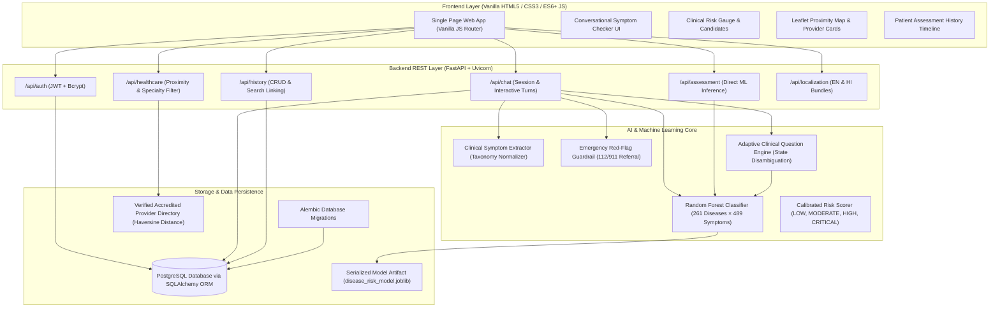

# CareGenie - Personalized AI Health Assistant for Disease Risk Assessment

[](https://fastapi.tiangolo.com)
[](https://python.org)
[](https://scikit-learn.org)
[](https://postgresql.org)
[](https://leafletjs.com)
[](LICENSE)

An academic, project-ready, full-stack web application uniting conversational AI, adaptive clinical follow-up questioning, Machine Learning disease risk assessment (**261 diseases × 489 symptoms**), multilingual support (English & Hindi), patient history tracking, and interactive Leaflet healthcare navigation.

---

> [!IMPORTANT]
> ### ⚠️ Mandatory Medical & Safety Disclaimer
> This application is strictly an **academic prototype** developed for **preliminary health-risk assessment, differential exploration, and healthcare navigation assistance**.
> - **NOT A DIAGNOSIS**: This software does **not** provide definitive clinical diagnoses.
> - **NO PRESCRIPTIONS**: This software **never** prescribes medications, pharmaceutical agents, or therapeutic dosages.
> - **NO FABRICATION**: Healthcare provider listings are strictly sourced from verified, accredited medical institutions.
> - **EMERGENCY ESCALATION**: If you or anyone around you experiences severe symptoms (crushing chest pain, severe shortness of breath, acute neurological deficits, sudden paralysis, loss of consciousness, uncontrolled bleeding), **immediately call emergency medical services (112 / 911) or visit the nearest emergency room**.

---

## 🏗️ System Architecture



---

## 🌟 Core Features & Implementation Highlights

### 1. Conversational AI & Adaptive Symptom Exploration
- **Context-Aware Dialogue**: Maintains multi-turn conversation memory (`ChatSession` and `ChatMessage` models).
- **Clinical Information Extraction**: Extracts chief complaints, duration, severity, and associated symptoms against a 489-symptom vocabulary.
- **Adaptive Follow-Up Engine**: Detects missing clinical context (duration, intensity) and dynamically generates targeted differential questions from top-overlapping disease candidates to resolve diagnostic ambiguity.
- **Early-Stop Criteria**: Automatically halts follow-up questions once sufficient clinical context is established or upon patient request.

### 2. Machine Learning Disease Risk Prediction
- **Trained Model**: Random Forest Classifier trained on synthetic patient vectors derived from 261 diseases and 489 symptom indicators.
- **Ensemble Inference**: Combines model class probabilities (60%) with empirical binary symptom overlap scores (40%) for robust, calibrated confidence scores.
- **Stratified Risk Tiers**: Categorizes findings into **LOW**, **MODERATE**, **HIGH**, or **CRITICAL** risk levels with clinical rationales.
- **Specialist Router**: Recommends medical specialties (e.g. *Cardiologist*, *Pulmonologist*, *Neurologist*, *General Physician*) tailored to the predicted condition.

### 3. Safety Guardrails & Emergency Triage
- **Deterministic Red-Flag Detection**: Scans inputs in real-time for cardiac emergencies, respiratory distress, acute stroke indicators, and severe shock.
- **Immediate Escalation**: Emergency triggers instantly bypass questionnaires, display high-contrast emergency banners with 112/911 quick-call buttons, and list nearby 24/7 trauma hospitals.

### 4. Bilingual Localization (English & Hindi)
- **Native Support**: Full UI and clinical responses available in English and Hindi (हिन्दी).
- **Multilingual Symptom Map**: Recognizes Devanagari script (e.g., *तेज़ बुखार*, *खांसी*, *छाती में दर्द*) and Hinglish transliterations (*tez bukhar*, *khansi*, *sar dard*).

### 5. Interactive Healthcare Provider Map
- **Leaflet & OpenStreetMap**: Interactive map embedded directly in the frontend with custom clinical pulse markers.
- **Geospatial Proximity**: Great-circle **Haversine formula** computes accurate distances in kilometers from user GPS coordinates or selected cities.
- **Verified Directory**: Curated multi-specialty hospitals and clinics across major hubs with emergency contact numbers and 24/7 ER indicators.
- **Referral Handoff**: Clicking "Find Nearby Specialist" from the Risk Dashboard automatically opens the map pre-filtered for the relevant medical department.

### 6. Patient History & Session Persistence
- **Audit Trail**: Saves finalized consultations with symptom profiles, predicted conditions, risk levels, and linked healthcare searches.
- **Data Privacy**: Strict tenant isolation ensures users can only access their own assessments and chat sessions.

---

## 📁 Repository Structure

```text
personalized-ai-health-assistant/
├── backend/
│   ├── app/
│   │   ├── api/
│   │   │   ├── routes/              # Modular API routers (auth, chat, assessment, history, healthcare, localization)
│   │   │   └── deps.py              # Auth and database dependencies
│   │   ├── core/                    # App configuration, database engine, security
│   │   ├── models/                  # SQLAlchemy ORM models (User, Assessment, ChatSession, ChatMessage)
│   │   ├── schemas/                 # Pydantic v2 validation models
│   │   ├── services/                # Business logic services
│   │   ├── ai/                      # Clinical prompts, safety rules, symptom extractor, adaptive engine
│   │   ├── prediction/              # ML training script, predictor service, serialized model artifact
│   │   ├── localization/            # JSON translation bundles (en.json, hi.json) and symptom maps
│   │   └── main.py                  # FastAPI application entry point
│   ├── alembic/                     # Database migrations
│   ├── tests/                       # 57 automated Pytest unit, integration, and E2E tests
│   └── requirements.txt             # Python backend dependencies
├── frontend/                        # Vanilla HTML5 / CSS3 / ES6+ JavaScript Single-Page App
│   ├── index.html                   # Mobile-first semantic HTML5 interface
│   ├── css/style.css                # Clinical Empathy design system stylesheet
│   └── js/
│       ├── api.js                   # Pure Fetch API client module
│       └── app.js                   # Application state manager & DOM router
├── data/                            # 261-disease × 489-symptom CSV binary matrix
├── postman_collection.json          # Complete Postman v2.1 test collection (25 endpoints)
├── .env.example                     # Environment variables configuration template
└── README.md                        # Project documentation
```

---

## 🚀 Quick Start Guide

### 1. Prerequisites
- **Python**: Version 3.10 to 3.13
- **PostgreSQL**: Version 14 or higher (or SQLite for testing)
- **Modern Web Browser**: Chrome, Firefox, Safari, Edge

### 2. Environment Setup

```bash
# Clone the repository
git clone https://github.com/your-username/personalized-ai-health-assistant.git
cd personalized-ai-health-assistant

# Navigate to backend directory
cd backend

# Create and activate a Python virtual environment
python3 -m venv venv
source venv/bin/activate    # On Windows: venv\Scripts\activate

# Install all backend dependencies
pip install -r requirements.txt
```

### 3. Configuration

Copy the sample environment file and update your configuration:
```bash
cp .env.example .env
```

Ensure your `.env` contains valid PostgreSQL credentials and a secure JWT secret:
```ini
PROJECT_NAME="Personalized AI Health Assistant"
ENVIRONMENT="development"
DEBUG=True

# Database (PostgreSQL)
POSTGRES_SERVER=localhost
POSTGRES_USER=postgres
POSTGRES_PASSWORD=postgres
POSTGRES_DB=health_assistant_db
POSTGRES_PORT=5432

# Security & JWT Authentication
SECRET_KEY="your-super-secret-key-change-this-in-production"
ALGORITHM="HS256"
ACCESS_TOKEN_EXPIRE_MINUTES=1440

# Default Language
DEFAULT_LANGUAGE="en"
```

### 4. Database Migrations

Apply Alembic migrations to set up database tables:
```bash
alembic upgrade head
```

*(Note: In development and test environments, tables are automatically initialized upon startup if SQLite is configured).*

### 5. Start the Application Server

```bash
uvicorn app.main:app --reload --port 8000
```

The application is now live:
- 🌐 **Web Application**: [http://localhost:8000/app](http://localhost:8000/app) or [http://localhost:8000/](http://localhost:8000/)
- 📖 **Interactive Swagger UI**: [http://localhost:8000/docs](http://localhost:8000/docs)
- 📑 **ReDoc Documentation**: [http://localhost:8000/redoc](http://localhost:8000/redoc)

---

## 🧪 Testing & Verification

The project includes **57 comprehensive automated tests** validating every layer:
- Authentication & tenant isolation
- Conversational chat memory
- Structured symptom extraction & bilingual normalization
- Adaptive follow-up question engine & stopping logic
- Random Forest ML disease risk prediction & risk tier calibration
- Haversine proximity calculations & emergency 24/7 filters
- Full end-to-end clinical journey (`test_system_e2e.py`)

Run the test suite:
```bash
cd backend
./venv/bin/pytest -v
```

Expected output:
```text
======================= 57 passed, 2 warnings in 21.97s ========================
```

---

## 📮 API Reference & Postman Collection

A complete **Postman Collection v2.1** is included at [`postman_collection.json`](postman_collection.json) with pre-configured headers, query parameters, and example payloads for all 25 endpoints across 7 modules:

| Module | Method | Endpoint | Description |
| :--- | :--- | :--- | :--- |
| **Auth** | `POST` | `/api/auth/register` | Register new user account |
| **Auth** | `POST` | `/api/auth/login` | Authenticate with JSON payload |
| **Auth** | `POST` | `/api/auth/token` | OAuth2 standard form-data login |
| **Users** | `GET` | `/api/users/me` | Retrieve authenticated profile |
| **Users** | `PATCH` | `/api/users/me` | Update user details & language |
| **Chat** | `POST` | `/api/chat/sessions` | Create a new clinical chat session |
| **Chat** | `GET` | `/api/chat/sessions` | List active user chat sessions |
| **Chat** | `POST` | `/api/chat/sessions/{id}/interact` | Send message & receive adaptive clinical reply |
| **Chat** | `POST` | `/api/chat/sessions/{id}/finalize-assessment` | Finalize session into ML assessment & archive |
| **Assessment** | `POST` | `/api/assessment/predict` | Direct ML disease risk inference |
| **History** | `GET` | `/api/history` | List user's historical clinical assessments |
| **History** | `GET` | `/api/history/{id}` | Retrieve individual assessment details |
| **History** | `POST` | `/api/history/{id}/searches` | Link healthcare facility search to assessment |
| **History** | `DELETE` | `/api/history/{id}` | Delete assessment record |
| **Healthcare** | `GET` | `/api/healthcare/nearby` | Proximity provider search (Haversine distance) |
| **Healthcare** | `GET` | `/api/healthcare/specialties` | List available medical departments |
| **I18n** | `GET` | `/api/languages` | List supported application languages |
| **I18n** | `GET` | `/api/localization/{lang}` | Fetch UI localization translation bundle |
| **Health** | `GET` | `/api/health` | Backend service health check |

---

## 🎨 UI/UX Design System (Clinical Empathy)

The user interface follows the **Clinical Empathy** design system prototyped with **Google Stitch**:
- **Palette**: Deep Navy (`#0B192C`), Bio-Teal (`#0D9488`), Cyan (`#0284C7`), Slate Canvas (`#F8FAFC`), Amber (`#D97706`), Emergency Crimson (`#DC2626`).
- **Typography**: Inter / system UI font stack for clean legibility.
- **Accessibility**: High-contrast ratios, prominent emergency callouts, touch-friendly interactive targets, and responsive layouts across desktop, tablet, and mobile.
- **Zero Framework Bloat**: Pure native HTML5, modern CSS3 variables/flexbox/grid, and vanilla ES6+ JavaScript.

---

## 📜 Development Phases Completion Status

- [x] **Phase 1**: FastAPI Backend Foundation (`/api/health`, Swagger docs, project structure)
- [x] **Phase 2**: Database Models & User Authentication (PostgreSQL, Alembic, JWT, bcrypt)
- [x] **Phase 3**: Patient History CRUD (`Assessment` model, `/api/history`)
- [x] **Phase 4**: Chat System & Persistence (`ChatSession`, `ChatMessage`, `/api/chat`)
- [x] **Phase 5**: AI Integration & Symptom Extraction (Structured symptom extraction, safety disclaimers, triage)
- [x] **Phase 6**: Adaptive Questioning Engine (Context state awareness, disease disambiguation)
- [x] **Phase 7**: ML Risk Prediction Pipeline (Random Forest on 261 diseases × 489 symptoms, risk scoring)
- [x] **Phase 8**: AI + ML Assessment Integration (Session finalization, automated clinical archiving)
- [x] **Phase 9**: Multilingual Support (English & Hindi localization, Devanagari & Hinglish extraction)
- [x] **Phase 10**: Google Stitch UI/UX Design System & Prototypes (Clinical Empathy theme, 5 screens)
- [x] **Phase 11**: Frontend Implementation (Vanilla HTML5 / CSS3 / ES6+ JavaScript Single-Page Application)
- [x] **Phase 12**: Healthcare Map & Facility Finder (Haversine distance, specialty filtering, Leaflet map)
- [x] **Phase 13**: End-to-End System Integration (`test_system_e2e.py`, Postman collection)
- [x] **Phase 14**: Comprehensive Packaging & Production Run Guide (`README.md`, full test audit)

---

## 📄 License
This project is open-source under the [MIT License](LICENSE).
