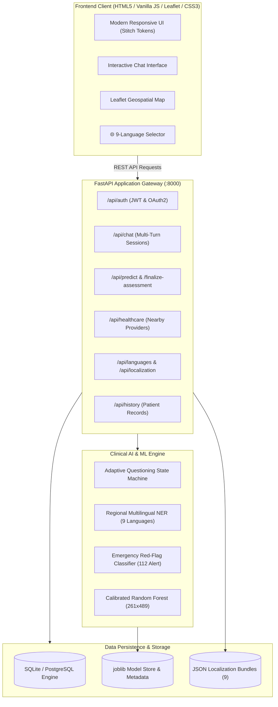
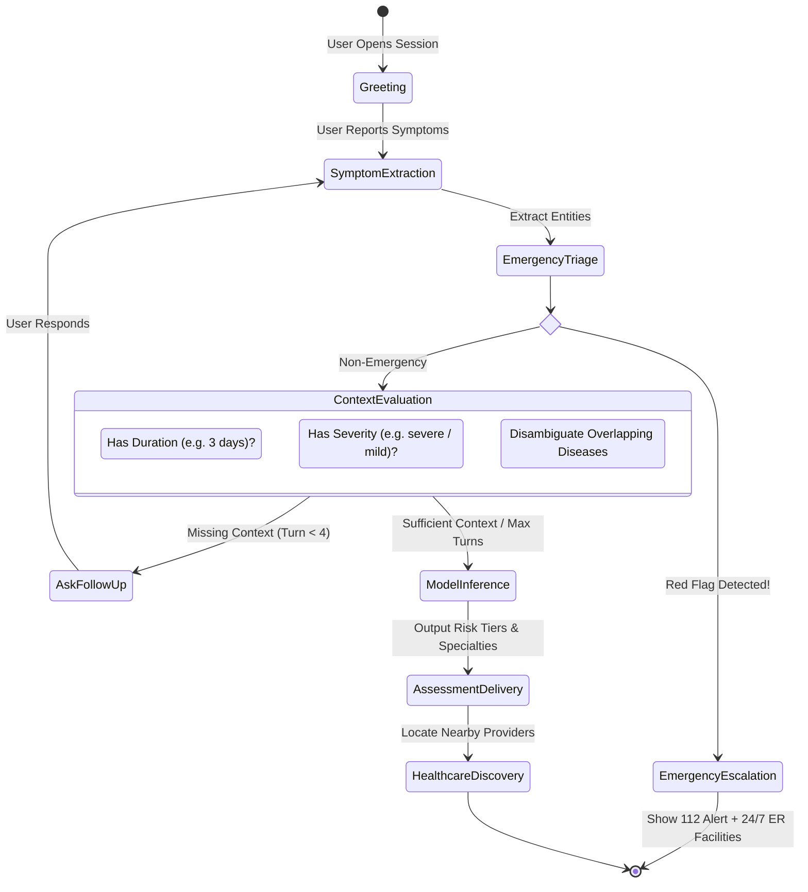
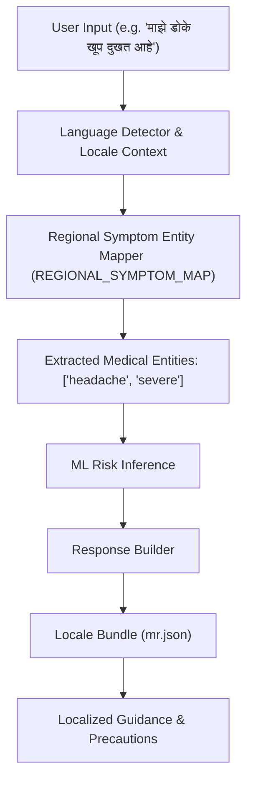
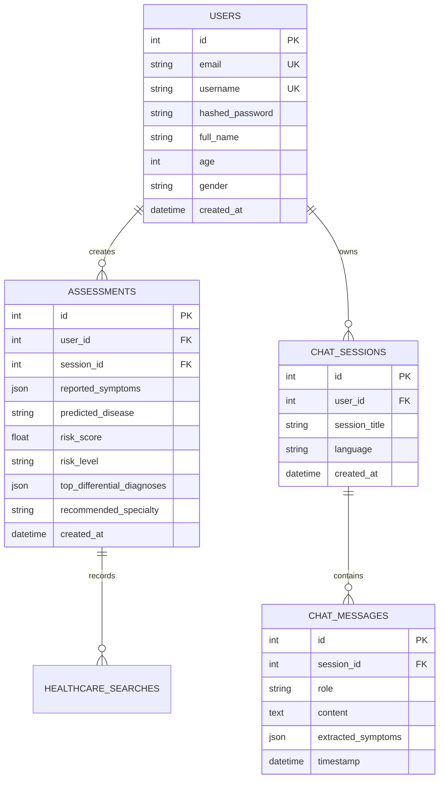

# System Design Document: Personalized AI Health Assistant
**Sub-title**: Intelligent Multi-Turn Symptom Assessment, ML Disease Risk Prediction & Geospatial Healthcare Discovery  
**Author**: Engineering & Clinical Informatics Team  
**Version**: 2.1.0  
**Status**: Implemented & Verified (Production Ready)

---

## 1. Executive Summary & Architectural Overview

The **Personalized AI Health Assistant** is an end-to-end clinical triage and disease risk estimation platform. It bridges the gap between patient self-reporting and professional medical care by:
1. Conducting **adaptive, multi-turn conversational symptom elicitation** in **9 regional Indian languages** (English, Hindi, Marathi, Bengali, Telugu, Tamil, Gujarati, Kannada, Punjabi).
2. Performing **emergency red-flag screening** with immediate escalation to national emergency hotlines (112/108/911).
3. Utilizing a calibrated **Machine Learning Classifier (Random Forest)** trained on 261 disease categories and 489 clinical symptoms.
4. Locating verified nearby healthcare facilities (hospitals, multi-specialty clinics, diagnostic centers) using real-time **GPS + IP geolocation** and **Haversine spatial filtering**.
5. Persisting clinical assessment records with user authentication, JWT-based security, and privacy isolation.



---

## 2. Design System & UI/UX Specifications

The visual identity and user interface are modeled on modern digital health applications, following the **Stitch Design System** guidelines.

### 2.1 Color Palette & Design Tokens
```css
:root {
  /* Brand Primary */
  --primary-teal: #0d9488;
  --primary-teal-hover: #0f766e;
  --primary-light: #f0fdfa;
  --primary-glow: rgba(13, 148, 136, 0.25);

  /* Secondary & Accents */
  --accent-cyan: #0284c7;
  --accent-cyan-light: #e0f2fe;
  --accent-purple: #7c3aed;

  /* Clinical Severity / Status */
  --risk-low: #10b981;      /* Green: Routine monitoring */
  --risk-moderate: #f59e0b; /* Amber: Non-urgent consultation */
  --risk-high: #ef4444;     /* Red: Urgent / Immediate care */
  --emergency-bg: #fef2f2;
  --emergency-border: #f87171;

  /* Surfaces & Typography */
  --bg-app: #f8fafc;
  --bg-card: #ffffff;
  --text-main: #0f172a;
  --text-muted: #64748b;
  --border-subtle: #e2e8f0;
}
```

### 2.2 Typography
- **Primary Font Family**: `'Inter', -apple-system, BlinkMacSystemFont, 'Segoe UI', Roboto, sans-serif`
- **Native Script Fallbacks**: Noto Sans Devanagari, Noto Sans Bengali, Noto Sans Telugu, Noto Sans Tamil, Noto Sans Gujarati, Noto Sans Kannada, Noto Sans Gurmukhi.
- **Hierarchy**:
  - `H1`: 2.25rem (36px), 700 weight, line-height 1.2
  - `H2`: 1.5rem (24px), 600 weight, line-height 1.3
  - `Body`: 0.95rem (15.2px), 400 weight, line-height 1.5
  - `Meta / Badges`: 0.75rem (12px), 600 weight, uppercase tracking

### 2.3 Visual Polish & Components
- **Card Glassmorphism**: `backdrop-filter: blur(12px); background: rgba(255, 255, 255, 0.92);`
- **Pulsing Map Indicators**: CSS keyframe pulse for user's detected location (`📍 You are here`).
- **Mobile Ergonomics**: Sticky bottom input bar on mobile screens, scroll lock prevention, touch-friendly 44px tap targets.

---

## 3. Conversational AI & Adaptive Clinical State Machine

Unlike static symptom checkers that present rigid 50-question forms, this system implements an **Adaptive Questioning State Machine** that mimics an experienced clinician's intake interview.



### 3.1 Adaptive Clarification Rules
1. **Duration Clarification**: If duration is unmentioned, asks: *"How long have you been experiencing [symptom]?"*
2. **Severity Clarification**: If intensity is unmentioned, asks: *"Could you describe the severity (mild, moderate, or severe)?"*
3. **Differential Disambiguation**: Queries for distinguishing symptoms when top diagnostic candidates share >70% symptom overlap.
4. **Early Exit / Stopping Condition**: If both duration, severity, and at least 3 clinical features are provided, questioning terminates early to prevent patient fatigue.

---

## 4. Machine Learning Diagnostic Engine

### 4.1 Model Architecture
- **Algorithm**: Random Forest Classifier with Isotonic Probability Calibration (`CalibratedClassifierCV`).
- **Feature Space**: 489 one-hot binary clinical symptom vectors.
- **Target Space**: 261 distinct disease classifications across internal medicine, cardiology, dermatology, gastrointestinal, neurology, and infectious diseases.
- **Artifact**: `backend/app/ai/models/disease_risk_model.joblib` with serialized feature names and label encoders.

### 4.2 Tiers of Risk Evaluation
| Risk Tier | Probability Range | Action Recommendation | UI Styling |
| :--- | :--- | :--- | :--- |
| **Low** | $P < 0.35$ | Routine self-care, hydration, schedule non-urgent checkup | Green Badge (`#10b981`) |
| **Moderate** | $0.35 \le P < 0.70$ | Schedule outpatient doctor consultation within 24-48 hours | Amber Badge (`#f59e0b`) |
| **High** | $P \ge 0.70$ | Immediate clinical evaluation at urgent care / ER | Red Badge (`#ef4444`) |

---

## 5. Geospatial Healthcare Provider Architecture

```mermaid
flowchart LR
    Browser["Client Browser"] -->|1. GPS Coordinates| GeolocationAPI["navigator.geolocation"]
    GeolocationAPI -->|Permission Denied| IPFallback["ipwho.is IP Geolocation"]
    GeolocationAPI -->|Coords (Lat, Lon)| ProviderAPI["/api/healthcare/nearby"]
    IPFallback -->|Coords (Lat, Lon)| ProviderAPI
    
    subgraph BackendEngine ["Spatial Query Engine"]
        Directory[("Verified Hospital Directory")]
        Haversine["Haversine Formula: d = 2R × sin⁻¹(√a)"]
        SpecFilter["Specialty & 24x7 Emergency Filter"]
    end
    
    ProviderAPI --> BackendEngine
    BackendEngine -->|Sorted Nearest Facilities| MapRenderer["Leaflet Map + Interactive Markers"]
```

### 5.1 Geolocation Strategy
1. **Tier 1 (High-Accuracy GPS)**: Uses hardware GPS/Wi-Fi positioning (`enableHighAccuracy: true`, 8s timeout). Reverse-geocoded via OpenStreetMap Nominatim.
2. **Tier 2 (IP Fallback)**: If browser permission is blocked, automatically fetches user city and approximate coordinates via client IP fallback.
3. **Tier 3 (Manual Search & Quick Cities)**: User can search any locality or pick from 10 major Indian metropolitan hubs (Mumbai, Pune, Delhi, Bengaluru, Hyderabad, Chennai, Kolkata, Ahmedabad, Jaipur, Lucknow).

---

## 6. Multilingual & Regional Localization Architecture

Supports **9 major Indian languages**: English (`en`), Hindi (`hi`), Marathi (`mr`), Bengali (`bn`), Telugu (`te`), Tamil (`ta`), Gujarati (`gu`), Kannada (`kn`), Punjabi (`pa`).



- **Dynamic Loading**: Locales are isolated into individual `.json` translation catalogs in `backend/app/localization/`.
- **Entity Transliteration**: Supports both native scripts and phonetic/Hinglish/transliterated input (e.g. *bukhar*, *khasi*, *sar dard*).

---

## 7. Data Models & Relational Schema



---

## 8. Security, Privacy & Clinical Compliance

1. **Authentication**: Stateless OAuth2 Bearer Tokens (JWT) signed with HMAC-SHA256, salted bcrypt password hashing (`passlib`).
2. **Data Isolation**: Multi-tenant database query scoping by authenticated `user_id`.
3. **Statutory Clinical Disclaimers**: In accordance with medical device and telehealth software safety guidelines, every assessment presents a mandatory disclaimer in the active language clarifying that the tool is an informational risk estimator, not a definitive medical diagnosis.
4. **Emergency Escalation Protocol**: Acute presentations (myocardial infarction, acute dyspnea, stroke) bypass diagnostic modeling and instantly deliver regional emergency telephone protocols.

---

## 9. File & Directory Layout

```text
personalized-ai-health-assistant/
├── DESIGN.md                   <-- This Document (System Architecture & Design)
├── README.md                   <-- Project Quickstart, API Docs & Setup Guide
├── postman_collection.json     <-- 25 Verified API Endpoints (Postman v2.1)
├── health_assistant.db         <-- SQLite Clinical Database
├── dataset/                    <-- Training Data (261 diseases x 489 symptoms)
│   ├── dataset.csv
│   └── symptom_severity.csv
├── ml-service/                 <-- Model Training Scripts & Evaluator
│   └── train_model.py
├── frontend/                   <-- Responsive Client Web App (HTML5 / Vanilla JS)
│   ├── index.html
│   ├── css/
│   │   ├── style.css
│   │   └── leaflet.css
│   └── js/
│       ├── api.js
│       ├── app.js
│       └── leaflet.js
└── backend/                    <-- FastAPI Production Backend Server
    ├── app/
    │   ├── main.py
    │   ├── api/routes/         (auth, chat, history, healthcare, localization)
    │   ├── ai/                 (prompts, adaptive state machine, ML service)
    │   ├── localization/       (i18n loader, 9 regional JSON bundles)
    │   ├── models/             (SQLAlchemy database models)
    │   └── schemas/            (Pydantic input/output validation contracts)
    └── tests/                  (58 passing unit, integration & E2E tests)
```
